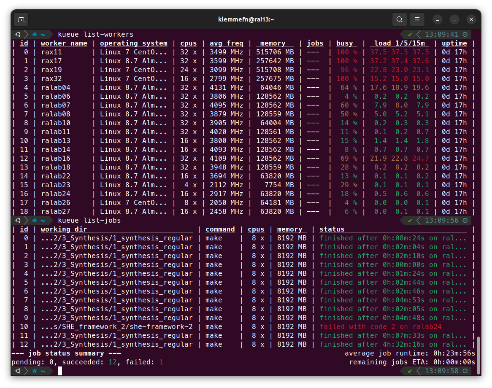

# Kueue

A robust, user-level, work-stealing, distributed task scheduler.

## Why Kueue?

Kueue has been developed in a university research environment. Often, scientific
experiments are conducted by running commercial tools or custom scripts multiple
times, with each execution requiring a certain amount of hardware resources and
run time. At the same time, the available computing infrastructure is
heterogenous, ranging from a few dedicated servers to a bunch of lab
workstations that might reboot from time to time. In such an environment,
distributing your workload to different machines can be a cumbersome task:
Which machines are currently free? How many jobs can I start/schedule on each
machine? Have my scripts completed or did the machine reboot in the meantime?

Kueue tries to alleviate these tasks while keeping the usability as simple as
possible. Its ease of use and the simple configuration is in parts inspired by
[Task Spooler](https://vicerveza.homeunix.net/~viric/soft/ts/), which I have
used for a long time. Running a job with Kueue should be as easy as running it
on the command line on your local machine. In practice, running `./my_script.py`
with Kueue on any free machine can be achieved with a simple prefix:
`kueue cmd ./my_script.py`.

### Kueue might be for you, when...

- You only have user privileges on available computing machines.
- A simple command-line interface suffices your needs.
- You are working on machines that reboot or shutdown regularly.
- A simple setup is more important than a rich set of features.

### Kueue might _not_ be for you, when...

- You have root privileges and can install an established (multi-user)
  scheduling system instead.
- You have no shared filesystem and thus need to attach data to your jobs
  inquiries.

## Preparation

Kueue works in a client-server model, which requires the `kueue_server` to be
running on one machine, and `kueue_worker` on all machines that should carry out
the execution of jobs. The `kueue_server` process needs to be reachable on a
(freely specifiable) TCP network port. Similar to the worker, `kueue` (the
command-line client) connects to the server using the same TCP port on the
server. Authentication is done with a `shared_secret` that must be identical on
all your machines. Kueue runs completely in user-level mode and all jobs are
executed with the privileges that `kueue_worker` is started with. Therefore,
make sure not to leak the `shared_secret` in your config, otherwise other people
can spawn processes on your behalf!

In many infrastructures, `/home` and other directories are mounted/synchronized
over the network. If the user's home is synced, the configuration at
`~/.config/kueue/config.toml` can be easily accessed by all processes.
Otherwise, you might need to distribute your config manually to all machines.
All scheduled jobs are executed with respect to their current working directory.
A worker will only execute the job if they can see the same directory (or a
directory with the same path on their system).

## Installation

The simplest way to obtain Kueue is by downloading it directly from
[crates.io](https://crates.io/crates/kueue). This requires you to install Rust
first, which also needs no root privileges if the basic dependencies are already
installed. By default, all files will be installed into your home directory. In
an environment with synchronized home directories, this means that you usually
only need to go through the installation process once.

### Installing Rust

Make sure you have a C/C++ compiler installed. Then, install
[Rust](https://www.rust-lang.org/tools/install) as usual.

    curl https://sh.rustup.rs -sSf | sh

### Installing OpenSSL

You need to install OpenSSL headers as a dependency of Kueue. On many systems,
it might already be installed. On Ubuntu, the following packages will suffice:

    sudo apt install pkg-config libssl-dev

### Installing Kueue

Finally, use Cargo (which is included in the Rust installation) to install (or
update) Kueue.

    cargo install kueue

This will install `kueue` (the client), `kueue_server`, and `kueue_worker` into
the `bin` folder of your Rust installation.

## Basic configuration

Upon the first start of any Kueue binary, a template config file is created at
`~/.config/kueue/config.toml`. It is worthwile to look at the default settings
and adjust them to your needs. A description of all settings can be found in the
[documentation](https://docs.rs/kueue/latest/kueue_lib/config).

The most important settings are in the `[common_settings]` section. Make sure
that the `shared_secret` in your config is the same on all systems you want to
use. The same is probably true for `server_name` and `server_port`, which is
used by clients and workers to connect to your server.

    [common_settings]
    shared_secret = "keep private!"
    server_name = "ralab29"
    server_port = 11236

To get started, run `kueue_server` on the machine you want to use a the server,
and `kueue_worker` on all machines you want to execute jobs on. Note that these
programs start in foreground, so you might use a tool like
[screen](https://linux.die.net/man/1/screen) to send the processes to the
background and keep them alive while you're not logged in.

## Global resources (e.g. license management)

Kueue can handle "global" resources that must be respected among all workers at the same time, such as licenses. We demonstrate how to use the feature by example. To get started, add a new table of resources to your config, named `[global_resources]`. Afterward, specify one resource per line, like in the following example.

    [global_resources]
    primelib = 31
    genus = 3

In this example, we specified two types of licenses and an amount for each license that can be used by jobs at the same time. Let's assume that `my_script.sh` requires one `genus` license to run. This can be achieve with the following command:

    kueue cmd --resource genus ./my_script.sh

In the following example, our script requires not only one `genus` license but also 4 `primelib` licenses:

    kueue cmd --resource genus --resource primelib=4 ./my_script.sh

By providing required global resources accordingly, Kueue can schedule jobs conflict-free.

## Restart workers

Kueue comes with a simple tool named `kueue_restart_workers` that checks the
state of your workers and attempts to restart them if they went down. To use the
tool, add a new block to your `config.toml` like the following:

    [restart_workers]
    ssh_user = "klemmefn"
    hostnames = """
    rax11   rax17   rax19   rax32
    ralab04 ralab06 ralab07 ralab08
    ralab10 ralab11 ralab13 ralab14
    ralab16 ralab18 ralab22 ralab23
    ralab24 ralab25 ralab26 ralab27
    """
    sleep_minutes_before_recheck = 60

Currently, the tool uses your SSH key to connect to the workers and spawns the
worker task in the background using [screen](https://linux.die.net/man/1/screen).
Make sure that screen is installed on your workers and ssh login via key is
possible. Then, you can use the tool like this:

    # Make sure your SSH key is loaded.
    eval `ssh-agent -s`
    ssh-add ~/.ssh/id_rsa
    # Spawn "restart_workers" in the background.
    screen kueue_restart_workers

Keep in mind that `kueue_restart_workers` is not required for Kueue to work but
just a simple tool to make restarting workers simpler. You can also use any
other strategy to start and restart your remote workers.

# Frequently asked questions (FAQ)

## How do I upgrade to a newer version?

 1. If you are using `kueue_restart_worker` to spawn your worker processes, stop
    it first.
 2. Stop `kueue_server`. This will also terminate all connected worker processes.
 3. Run `cargo install kueue` on all your machines (or Kueue installations). If
    you have a shared home directory, a single `cargo install kueue` might be
    already sufficient.
 4. After the update has completed, restart `kueue_server`. If the server
    complains about unrecognized setting in you config, read the FAQ below.
 5. Restart your workers, e.g., by starting `kueue_restart_worker` again.

## How do I get a new version of the config file (TOML)?

In many cases, an update of the config file is not required when updating Kueue.
For any missing setting, a default value is assumed. The default values for all
settings can be found in the initial template config file that is generated on
first start.

A template config file is create with each start of any kueue binary, if there
is no existing config file in place. Therefore, a simple way to update your
config file is to make a backup (e.g., rename the config file) and simply run
`kueue` once. Afterwards, compare your backed-up config with the newly create
template and adjust the settings as you like.

## I get an error when starting the server!

    INFO  [kueue_server::server] Successfully started listening on 0.0.0.0:11236...
    ERROR [kueue_server::server] Failed to start listening on [::]:11236: Address already in use (os error 98)

The `kueue_server` supports listening on multiple interfaces, defined in
`bind_addresses` in the config file. This can be helpful, e.g., if you want to
allow clients to connect either via IPv4 (`0.0.0.0`) or IPv6 (`[::]`). The
server will try to bind each address individually with the port specified in
`server_port`. While this works fine on some systems, other system might
automatically bind both IPv4 and IPv6 addresses if either of `0.0.0.0` or `[::]`
is present. In this case, you get the above error message because the server
tries to bind the same address twice. You can ignore the message (the server
will still work) or you can fix it by removing one of `0.0.0.0` or `[::]` from
`bind_addresses`.

## How do I setup shell completion?

The `kueue` client supports shell completion on the command line with
[clap_complete](https://crates.io/crates/clap_complete). Calling
`kueue complete` and the name of your shell as another parameter returns the
completion script for your respective shell. You might evaluate the returned
script directly, or save it to a file and source it afterwards. An easy way
(tested with both _bash_ and _zsh_) is to put the `eval` statement directly into
your startup script. For instance, for _bash_, put
`eval "$(kueue complete bash)"` into your `~/.bashrc` script, and for _zsh_, put
`eval "$(kueue complete zsh)"` into your `~/.zshrc` script.
